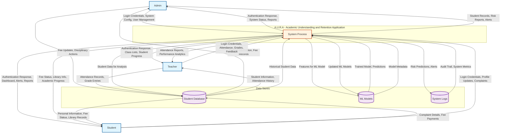

# Level 0 Data Flow Diagram

## A.U.R.A - Academic Understanding and Retention Application

This diagram shows the system context, illustrating the system as a single process interacting with external entities.

## Description

### External Entities
- **Admin**: System administrators who manage users, system configuration, and oversee operations
- **Teacher**: Educators who input attendance, grades, and monitor student progress
- **Student**: Learners who access their personal information, submit complaints, and view their risk status

### System Process
The A.U.R.A - Academic Understanding and Retention Application as a single automated process that:
- Authenticates users based on role
- Processes academic, attendance, financial, and behavioral data
- Applies machine learning models to predict student risk levels
- Generates early warning alerts and recommendations
- Provides role-appropriate views and reports
- Maintains system logs and audit trails

### Data Stores
- **Student Database**: Contains all persistent data including student profiles, attendance records, academic marks, fee transactions, library transactions, complaints, predictions, and alerts
- **ML Models**: Stores machine learning model metadata, trained model files, and performance metrics
- **System Logs**: Captures system activity, user actions, error logs, and audit trails for security and compliance

### Data Flows
The diagram illustrates how information flows between external entities and the system:
- Authentication credentials flow in both directions for login/logout processes
- Academic data (attendance, grades) flows from teachers to the system
- Financial data (fee payments) flows from admin and students to the system
- Behavioral data (complaints) flows from students to the system
- Processed information (risk predictions, alerts, reports) flows from the system to all user types
- Internal data flows support the machine learning pipeline and system maintenance

## Level 0 DFD Characteristics
- Shows the system as a single bubble (process)
- Focuses on inputs/outputs between system and external entities
- Does not show internal processes or detailed data flows
- Provides context for understanding system boundaries
- Serves as foundation for more detailed DFD levels