# Level 1 Data Flow Diagram

## A.U.R.A - Academic Understanding and Retention Application

This diagram shows the system decomposed into major processes, illustrating how data flows between processes and data stores.

```mermaid
flowchart TD
    %% External Entities
    Admin[Admin]:::external
    Teacher[Teacher]:::external
    Student[Student]:::external
    
    %% Data Stores
    subgraph DataStores[Data Stores]
        direction TB
        StudentDB[(Student Database)]:::datastore
        MLModels[(ML Models)]:::datastore
        SystemLogs[(System Logs)]:::datastore
    end
    
    %% Level 1 Processes
    subgraph Processes[System Processes]
        direction TB
        Auth[Authentication Process]:::process
        StudentMgmt[Student Management]:::process
        AttendanceMgmt[Attendance Management]:::process
        AcademicMgmt[Academic Management]:::process
        FeeMgmt[Fee Management]:::process
        LibraryMgmt[Library Management]:::process
        ComplaintMgmt[Complaint Management]:::process
        Prediction[Risk Prediction]:::process
        AlertGen[Alert Generation]:::process
        Reporting[Reporting & Analytics]:::process
    end
    
    %% Authentication Process Flows
    Admin -->|Login Credentials| Auth
    Teacher -->|Login Credentials| Auth
    Student -->|Login Credentials| Auth
    Auth -->|Authentication Token, Role| Admin
    Auth -->|Authentication Token, Role| Teacher
    Auth -->|Authentication Token, Role| Student
    Auth -->|Login Activity| SystemLogs
    SystemLogs -->|Login Attempts| Auth
    
    %% Student Management Flows
    Admin -->|Student CRUD Operations| StudentMgmt
    StudentMgmt -->|Student Lists, Profiles| Admin
    StudentMgmt -->|Student Data| StudentDB
    StudentDB -->|Student Records| StudentMgmt
    Student -->|Profile Updates| StudentMgmt
    StudentMgmt -->|Updated Profile| Student
    StudentMgmt -->|Student Data| AcademicMgmt
    StudentMgmt -->|Student Data| AttendanceMgmt
    StudentMgmt -->|Student Data| FeeMgmt
    StudentMgmt -->|Student Data| LibraryMgmt
    StudentMgmt -->|Student Data| ComplaintMgmt
    
    %% Attendance Management Flows
    Teacher -->|Attendance Records| AttendanceMgmt
    AttendanceMgmt -->|Attendance Confirmation| Teacher
    AttendanceMgmt -->|Attendance Data| StudentDB
    StudentDB -->|Attendance History| AttendanceMgmt
    AttendanceMgmt -->|Attendance Reports| Teacher
    AttendanceMgmt -->|Attendance Data| Prediction
    AttendanceMgmt -->|Attendance Reports| Reporting
    AttendanceMgmt -->|Attendance Logs| SystemLogs
    
    %% Academic Management Flows
    Teacher -->|Grade Entries, Subject Info| AcademicMgmt
    AcademicMgmt -->|Grade Confirmation| Teacher
    AcademicMgmt -->|Marks, Subject Data| StudentDB
    StudentDB -->|Academic Records| AcademicMgmt
    AcademicMgmt -->|Grade Reports, Transcripts| Teacher
    AcademicMgmt -->|Grade Reports, Transcripts| Student
    AcademicMgmt -->|Academic Data| Prediction
    AcademicMgmt -->|Academic Analytics| Reporting
    AcademicMgmt -->|Grading Logs| SystemLogs
    
    %% Fee Management Flows
    Admin -->|Fee Structures, Payment Processing| FeeMgmt
    FeeMgmt -->|Fee Lists, Payment Status| Admin
    Student -->|Fee Payments, Payment Info| FeeMgmt
    FeeMgmt -->|Payment Receipts, Status| Student
    FeeMgmt -->|Fee Transactions| StudentDB
    StudentDB -->|Fee Records| FeeMgmt
    FeeMgmt -->|Fee Reports, Aging| Admin
    FeeMgmt -->|Fee Reports| Reporting
    FeeMgmt -->|Overdue Notifications| AlertGen
    FeeMgmt -->|Transaction Logs| SystemLogs
    
    %% Library Management Flows
    Librarian[Librarian/Teacher]:::external
    Librarian -->|Book Issue/Return Requests| LibraryMgmt
    LibraryMgmt -->|Transaction Confirmation| Librarian
    LibraryMgmt -->|Library Transactions| StudentDB
    StudentDB -->|Library Records| LibraryMgmt
    Student -->|Book Search, Requests| LibraryMgmt
    LibraryMgmt -->|Book Availability, Status| Student
    LibraryMgmt -->|Overdue Books, Fines| AlertGen
    LibraryMgmt -->|Inventory Reports| Librarian
    LibraryMgmt -->|Usage Reports| Reporting
    LibraryMgmt -->|Transaction Logs| SystemLogs
    
    %% Complaint Management Flows
    Student -->|Complaint Submissions| ComplaintMgmt
    ComplaintMgmt -->|Complaint Receipt| Student
    Admin -->|Complaint Assignment, Resolution| ComplaintMgmt
    ComplaintMgmt -->|Assignment Notifications| Admin
    ComplaintMgmt -->|Resolution Updates| Student
    ComplaintMgmt -->|Complaint Records| StudentDB
    StudentDB -->|Complaint History| ComplaintMgmt
    ComplaintMgmt -->|Complaint Analytics| Reporting
    ComplaintMgmt -->|Complaint Logs| SystemLogs
    
    %% Risk Prediction Flows
    AttendanceMgmt -->|Attendance Features| Prediction
    AcademicMgmt -->|Academic Features| Prediction
    FeeMgmt -->|Fee Status Features| Prediction
    LibraryMgmt -->|Library Usage Features| Prediction
    ComplaintMgmt -->|Complaint Features| Prediction
    StudentMgmt -->|Demographic Features| Prediction
    Prediction -->|Risk Scores, Levels| StudentDB
    StudentDB -->|Historical Predictions| Prediction
    Prediction -->|Risk Assessments| AlertGen
    Prediction -->|Risk Reports| Reporting
    Prediction -->|Model Feedback| MLModels
    MLModels -->|Updated Models, Metadata| Prediction
    Prediction -->|Prediction Logs| SystemLogs
    
    %% Alert Generation Flows
    Prediction -->|High/Medium Risk Alerts| AlertGen
    FeeMgmt -->|Overdue Fee Alerts| AlertGen
    LibraryMgmt -->|Overdue Book Alerts| AlertGen
    AttendanceMgmt -->|Excessive Absence Alerts| AlertGen
    AcademicMgmt -->|Poor Performance Alerts| AlertGen
    ComplaintMgmt -->|Unresolved Complaint Alerts| AlertGen
    AlertGen -->|Alert Notifications| Admin
    AlertGen -->|Alert Notifications| Teacher
    AlertGen -->|Alert Notifications| Student
    AlertGen -->|Alert Records| StudentDB
    StudentDB -->|Alert History| AlertGen
    AlertGen -->|Alert Analytics| Reporting
    AlertGen -->|Alert Logs| SystemLogs
    
    %% Reporting & Analytics Flows
    Admin -->|Report Requests| Reporting
    Teacher -->|Report Requests| Reporting
    Student -->|Report Requests| Reporting
    Reporting -->|Custom Reports, Dashboards| Admin
    Reporting -->|Progress Reports, Analytics| Teacher
    Reporting -->|Personal Reports, Risk Status| Student
    Reporting -->|Report Logs| SystemLogs
    
    %% Styling
    classDef external fill:#e1f5fe,stroke:#01579b,stroke-width:2px;
    classDef process fill:#fff3e0,stroke:#bf360c,stroke-width:2px;
    classDef datastore fill:#f3e5f5,stroke:#6a1b9a,stroke-width:2px;
```

## Description

### Level 1 DFD Overview
This diagram decomposes the single system process from Level 0 into nine major processes, showing:
- How each process interacts with external entities (Admin, Teacher, Student)
- How data flows between processes
- How each process reads from and writes to data stores
- Where system logs are generated

### Process Descriptions

1. **Authentication Process**: Handles user login, session management, and role-based access control
2. **Student Management**: Manages student profiles, enrollment, and demographic information
3. **Attendance Management**: Records and tracks student attendance, generates attendance reports
4. **Academic Management**: Manages subjects, grade entry, academic performance tracking
5. **Fee Management**: Handles fee structures, payment processing, overdue tracking
6. **Library Management**: Manages book inventory, issue/return transactions, overdue tracking
7. **Complaint Management**: Handles student grievances, assignment, tracking, and resolution
8. **Risk Prediction**: Applies machine learning models to assess student dropout risk
9. **Alert Generation**: Creates and manages early warning notifications based on risk factors
10. **Reporting & Analytics**: Generates reports, dashboards, and analytics for decision-making

### Data Flow Patterns
- **Vertical Flows**: Between external entities and processes (user interactions)
- **Horizontal Flows**: Between processes (data sharing for integrated functionality)
- **Storage Flows**: Between processes and data stores (CRUD operations)
- **Feedback Loops**: From processes to ML Models (model retraining) and to Reporting (analytics)

### Key Integration Points
- All management processes feed data to the **Risk Prediction** process
- **Risk Prediction** feeds risk assessments to **Alert Generation**
- **Alert Generation** sends notifications to all user types
- All processes contribute to **Reporting & Analytics**
- All processes log activities to **System Logs**
- **ML Models** store and provide trained models for **Risk Prediction**

### Data Store Interactions
- **Student Database**: Central repository for all business data
- **ML Models**: Stores model artifacts and metadata for prediction service
- **System Logs**: Captures audit trail for security, compliance, and debugging

This Level 1 DFD provides a detailed view of the system architecture while maintaining clarity about data flows and process boundaries.